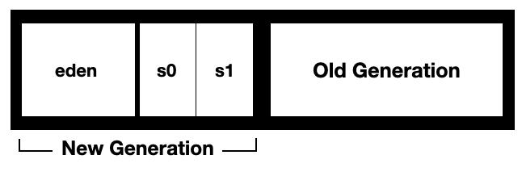

## Garbage Collector

JVM에서 동적으로 할당한 메모리 영역 중 사용하지 않는 영역을 탐지하여 해제하는 기능

### Mark & Sweep

**Marking** 

Stack의 모든 변수를 스캔하면서 메모리에서 사용되고 있는 영역을 찾아서 체크한다. (Reachable Object)

Reachable Object가 참조하고 있는 객체도 찾아서 체크한다. 

**Sweep  (Deletion)**

UnReachable Object를 Heap에서 제거한다. 

### **Heap**

Old Generation

Young Generation : eden, survival0, survival1

**Minor GC**

새로운 객체는 Eden 영역에 할당

Eden 영역이 가득차면 Minor GC 수행

Reachable Object - S0으로 할당

UnReachable Object - 메모리 해제

S0이 가득차게 되면 Reachable Object만 S1으로 할당

S1이 가득차게 되면 Reachable Object만 S0으로 할당, 이 때 이동한 Object의 Age값을 할당해 영역을 이동할 때마다 Age값을 증가시킨다.

survival 영역은 무조건 하나는 비어있어야 한다. 

**Promotion**

Age 값이 일정 이상이 되면 Old Generaion으로 이동

**Major GC**

Old Generation에서 수행하는 Garbage Collecting (Mark & Sweep) 과정

### Stop The World

JVM은 GC를 수행할 때 GC를 수행하는 스레드를 제외한 모든 스레드 실행을 중단시킨다.

GC 작업이 완료되면 중단했던 작업을 다시 수행시키는데, 이와 같이 GC외의 작업이 멈춘 상태를 Stop-The-World라고 한다.

### 종류

**Serial GC**

- GC를 수행하는 스레드가 1개이고, CPU 코어가 1개일 때 사용한다.
- Mark-Compact Collection 알고리즘을 사용한다. 
Compact : Mark & Sweep 이후 분산된 메모리를 모아서 메모리 파편화를 줄이는 방법

**Parallel GC**

- GC를 수행하는 스레드가 2개 이상이고, CPU 코어 개수가 많고 메모리가 많을 때 유리하다.
- Serial GC보다 빠르다.

**Concurrent Mark Sweep GC**

- Stop-The-World 시간을 줄이기 위해 고안된 방법으로 어플리케이션 속도 향상에 도움이 된다.
- Tri-color Marking 알고리즘을 사용한다.
- GC 수행 시, 다른 작업을 수행하는 스레드를 반만 멈추고 나머지는 Marking을 수행한다.
- Initial Mark, Concurrent Mark을 수행하고 Concurrent PreClean 및 Sweep을 진행한다.
- 따라서 전체 GC 수행시간은 Parallel GC보다 길다. CPU 코어와 메모리 사용량이 크고 Compact를 수행하지 않는다.

**G1 GC**

- 메모리를 계획도시처럼 영역별로 나뉘어 GC 수행을 영역별로 수행하는 방식이다.
- 전체 영역(Eden, Survival, Old Generation)을 탐색하지 않는다.
- Java9의 기본 방식
