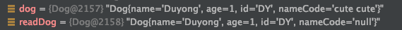

# transient 키워드


테스트할 Dog 클래스다. 

```java
@Getter
@Builder
public class Dog implements Serializable {

    private String name;
    private int age;
    private String id;
    private transient String nameCode;

    public static Dog empty() {
        return Dog.builder()
                .build();
    }

    @Override
    public String toString() {
        return "Dog{" +
                "name='" + name + '\'' +
                ", age=" + age +
                ", id='" + id + '\'' +
                ", nameCode='" + nameCode + '\'' +
                '}';
    }
}
```
nameCode라는 변수에 transient 키워드를 선언해뒀다. 

<br> 

테스트 코드는 다음과 같다. 

```java
public class TransientTest {

    private static final String FILE_NAME = "파일 추가 경로";

    @Test
    void test() {
        Dog dog = Dog.builder()
                .name("Duyong")
                .age(1)
                .id("DY")
                .nameCode("cute cute")
                .build();

        doSerialize(dog);
        Dog readDog = doDeSerialize();

        assertNull(readDog.getNameCode());
        assertEquals(dog.getName(), readDog.getName());
        assertEquals(dog.getAge(), readDog.getAge());
        assertEquals(dog.getId(), readDog.getId());
    }

    @Test
    void doSerialize(Dog dog) {
        try (FileOutputStream fos = new FileOutputStream(FILE_NAME);
             ObjectOutputStream oos = new ObjectOutputStream(fos)) {

            oos.writeObject(dog);

        } catch (IOException e) {
            // catch Exception 
        }
    }

    private Dog doDeSerialize() {
        try (FileInputStream fis = new FileInputStream(FILE_NAME);
             ObjectInputStream ois = new ObjectInputStream(fis)) {

            return (Dog) ois.readObject();
            
        } catch (IOException e) {
            // catch Exception 
        } catch (ClassNotFoundException e) {
            // catch Exception 
        }

        return Dog.empty();
    }
}
```

직렬화 및 역잭렬화를 수행하고 나면, <br>
이와 같이 readDog의 nameCode가 null인 것임을 알 수 있다.



transient 필드는 기본 직렬화 시, 기본값으로 초기화된다. 
객체인 경우 null로, 기본 숫자 타입인 경우 0으로, boolean 타입인 경우 false로 변경된다고 보면 된다.  
이 때문에 역직렬 시 nameCode가 null로 남게 된다. 

이를 그대로 사용하면 안되는 경우,
readObject 메서드의 defaultReadObject를 호출한 다음에 해당 필드를 원하는 값으로 바꿀 수 있다. 


