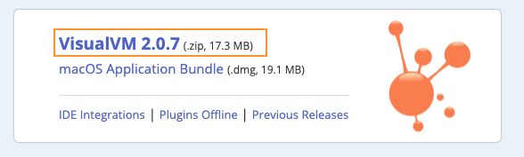
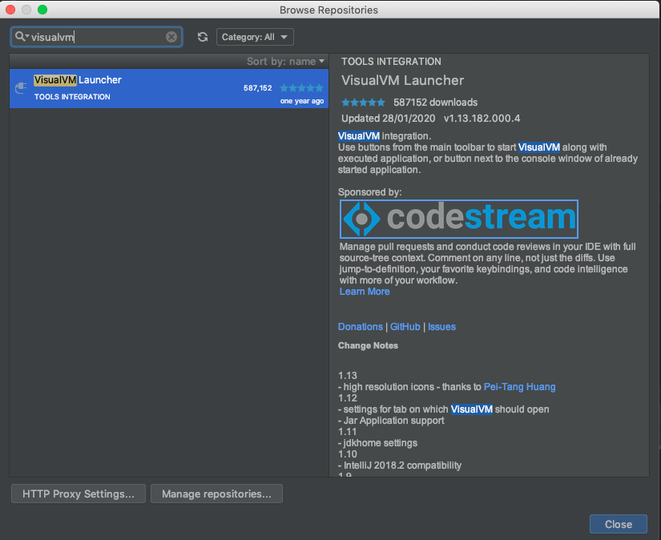
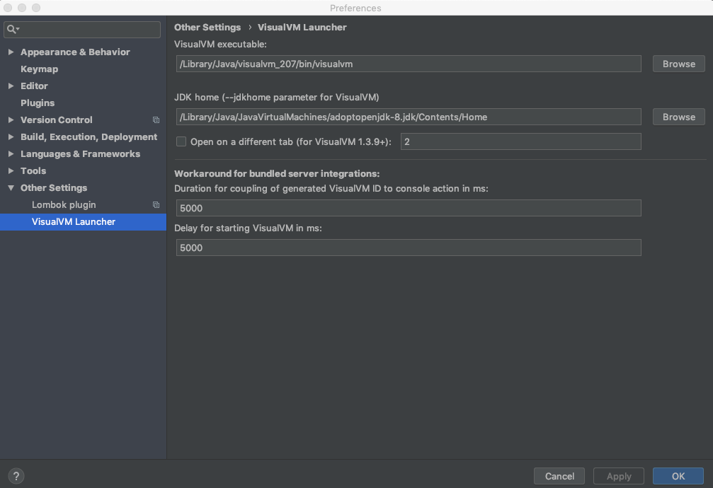
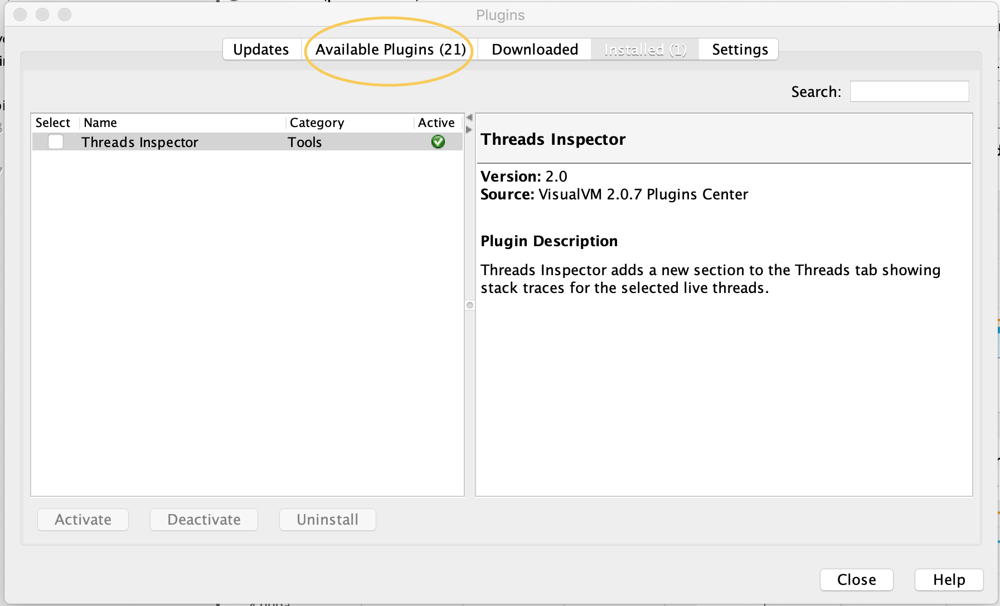

# visualVM intellij 연동해서 Thread 모니터링해보기

## 설치 및 준비 

### 1. visualVM 다운로드
- [visualVM 공식 홈페이지](https://visualvm.github.io/)에서 zip 파일 다운로드
- zip 파일 압축을 해제하면 “visualvm_버전” 파일이 생성되는데, 파일 통째로 /Library/Java 하위로 이동
ex) /Library/Java/visualvm_207

### 2. VisualVM Launcher Plugins 설치
- Intellij > Plugins > Browe repositories 에서 visualVm 검색
- VisualVM Launcher  Install
- Install 완료 후 intellij 재실행

### 3. VisualVM Launcher 환경변수 설정
- Preferences > Other Settings > VisualVM Launcher
- VisualVM executable, JDK home 설정을 변경해준 후 Apply

### 4. VisualVM을 이용해 실행
- 다음과 같이 Run With VisualVM, Debug With VisualVM 아이콘이 생성됨

- With VisualVM으로 실행
- VisualVm Application이 자동실행
- Local 탭에 Tomcat (pid: ~ ) 와 같이 실행된 톰캣 정보를 확인

  

## 모니터링

### 상단 탭 

- **Overview** : 프로세스 ID, Host, JVM 설정을 확인할 수 있다. 
- **Monitor** : CPU, Heap, Classes, Threads 운영의 전반전인 지표 확인
- **Threads** : 스레드 운영 상황 확인, 스레드 덤프 정보  
  Tools > Plugins > Available Plugins > Thread Inspector 설치를 하게 되면 활성화된 스레드의 stack trace를 확인할 수 있다.  
  
- **Sampler**

 

### Thread 

